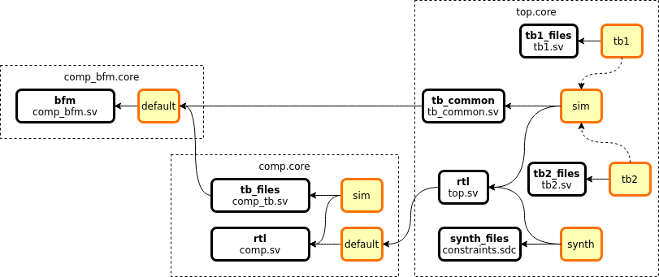

*****************************
Common Problems and Solutions
*****************************

Making changes to cores in a library
====================================

A common situation is that a user wants to use their own copy of a core,
instead of the one provided by a library, for example to fix a bug or
add new functionality. The following steps can be used to achieve this:

**Example.** Replace a core in a library with a user-specified version

#. Create a new directory to keep the user-copies of the cores (this
   directory will be referred to as ``$corelib`` from now on)
#. Download the core source (the repository or URL can be found in the
   ``[provider]`` section of the original core)
#. *If the downloaded core already contains a .core file, this step is
   ignored* Copy the original .core file to the root of the downloaded
   core. Edit the file and remove the ``[provider]`` section. (This will
   stop FuseSoC from downloading the core and use files from the
   directory containing the .core file instead)
#. Add ``$corelib`` to the end of your library search path, either by
   editing ``fusesoc.conf`` or by adding ``--cores-root=$corelib`` to
   the command-line arguments
#. Verify that the new core is found by running fusesoc core-info $core. Check
   the output to see that “Core root:” is set to the directory where the core
   was downloaded

Dependency tree for a core with optional components
===================================================

Many cores have a part that is only used in some flows. This could for example be a BFM, VIP or some kind of behavioral model that is only used in simulation flows. Or it could be timing constraints for synthesis. As long as these are only by the core itself, it's easiest to put them into different filesets and let each simulation or synthesis target pick the right subset of filesets.

A more complicated situation arises when a user uses this core as a dependency and wants to have different filesets for different flows in the toplevel core. In this case, it is typically better to split out the optional part into its own cores and have the toplevel filesets depend on the different cores.

**Example** Let's assume a core (comp) comes with a BFM. We want to use the BFM when doing block-level simulations of the core and when doing full system simulations which uses this core. We don't want to have the BFM present when doing full system synthesis. The most general solution is to split out the BFM to a separate core file. The following example shows a setup with a component (comp.core) that has a BFM (comp_bfm.core) which is used inside a larger system (top.core). The component has a testbench target (sim) and the larger system has two testbenches (tb1 and tb2) which both uses the BFM and the component. The larger system can also be synthesized without the BFM.

.. code-block:: yaml
   :caption: comp_bfm.core

    CAPI=2:

    name : ::comp_bfm:0

    filesets:
      bfm:
        files: {comp_bfm.sv : {file_type : systemVerilogSource}}

    targets:
      default:
        filesets : [bfm]

.. code-block:: yaml
   :caption: comp.core

    CAPI=2:

    name : ::comp:0

    filesets:
      rtl:
        files: {comp.sv : {file_type : systemVerilogSource}}

      tb_files:
        files: {comp_tb.sv : {file_type : systemVerilogSource}}
        depend: [comp_bfm]

    targets:
      default:
        filesets : [rtl]

      sim:
        filesets : [rtl, tb_files]

.. code-block:: yaml
   :caption: top.core

    CAPI=2:

    name : ::top:0

    filesets:
      rtl:
        files: {top.sv : {file_type : systemVerilogSource}}
        depend: [comp]

      tb_common:
        files: {tb_common.sv : {file_type : systemVerilogSource}}
        depend: [comp_bfm]

      tb1_files:
        files: {tb1.sv : {file_type : systemVerilogSource}}

      tb2_files:
        files: {tb1.sv : {file_type : systemVerilogSource}}

      synth_files:
        files: {constraints.sdc : {file_type : SDC}}

    targets:
      sim: &sim
        filesets : [rtl, tb_files]

      tb1:
        <<: *sim
        filesets_append : [tb1_files]

      tb2:
        <<: *sim
        filesets_append : [tb2_files]

      synth:
        filesets : [rtl, synth_files]

An alternative solution to the above, is to use flags, as described in :ref:`ug_build_system_flags`, where the inclusion of the optional files are controlled by flags. These flags can be assigned default values in the top level targets for convenience.
